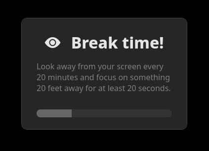

# PowerDesk (alpha)
A collection of small desktop addons and utilities for Linux, aiming to enhance your experience. Early alpha version (still far from stable).

## OS Support

| OS      | Supported Versions |
|---------|---------------------|
| ✅ Linux   | Nearly all desktops (tested on Fedora 41, Cinnamon DE) |
| 🟧 Windows | Experimental support             |
| ❌ macOS   | Not supported                    |

## Installation
Required: NodeJS and NPM (eg. `dnf install nodejs npm`)
```sh
# First time, install modules:
npm i
```
Then run with:
```sh
npm start
```
You can start the program on startup, it will run quietly in the background.


## Strengths
- Customizable UI: you can change the color accent to any color, or enable an experimental acrylic (semi-transparent) window style.
<br>


## Clipboard manager
A simple and elegant clipboard manager, opens with Alt+V, ability to save to disk or cloud sync, handles text, metadata, images and files.

Inspired by the Win+V clipboard manager in Windows.

TODO:
- Add a pin button to save items
- Add a delete button to individual items
- Add a + button to allow adding custom entries
- Maybe add folders


## Emoji picker
An emoji picker with categories and search.

TODO:
- Recents tab
- Better UI


## Locked folders (Linux only)
Locked (encrypted) folder management, using [gocryptfs](https://github.com/rfjakob/gocryptfs).<br>
Allows to lock and unlock folders using a simple GUI.<br>
This feature is in a very early stage and more of a rough concept.<br>
It is disabled by default - to enable, add a folders.json file inside `/tools/clipboard/` with this structure: `[{ "name": "Examlpe", "path": "/home/user/Pictures/", "color": "blue" }]`.<br>
Folder names for encrypted/plain default to "cipher" and "plain" and can be overriden with the plainFolder and cipherFolder options.<br>

TODO:
- Code quality changes
- Add +, edit, remove, and create buttons
- More auth options


<!-- Hello world! -->


## 20-20-20 Reminder
A simple reminder that shows up every 20 minutes, reminding you to look away from the screen for 20 seconds and focus on something 20 feet away to help reduce eye strain.



## Desktop FX (Upcomming)
A custom desktop/wallpaper engine allowing you to customize your desktop, add widgets, effects, animated wallpapers, and more.


