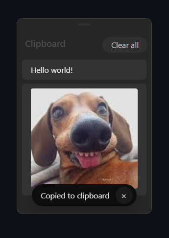

# PowerDesk (alpha preview)
A collection of small desktop addons and utilities for Linux. Early alpha version (Far from stable).

## OS Support

| OS      | Supported Versions |
|---------|---------------------|
| ✅ Linux   | Most desktops* (tested on Fedora 41, Cinnamon DE) |
| 🟧 Windows | Experimental support             |
| ❌ macOS   | Not supported                    |

\*GNOME may have some issues and since there is no system tray, launching the dashboard is an extra step. Other desktops should be fine.

## Installation
Required: NodeJS and NPM (eg. `dnf install nodejs npm`)
```sh
# First time, install modules:
npm i
```
Then run with:
```sh
npm start
```
You can start the program on startup, it will run quietly in the background.


## Strengths
- Customizable UI: you can change the color accent to any color, or enable an experimental acrylic (semi-transparent) window style.
<br>


## Clipboard manager
A simple and elegant clipboard manager, opens with Alt+V, ability to save to disk or cloud sync, handles text, metadata, images and files.

Inspired by the Win+V clipboard manager in Windows.



<!-- Hello world! -->